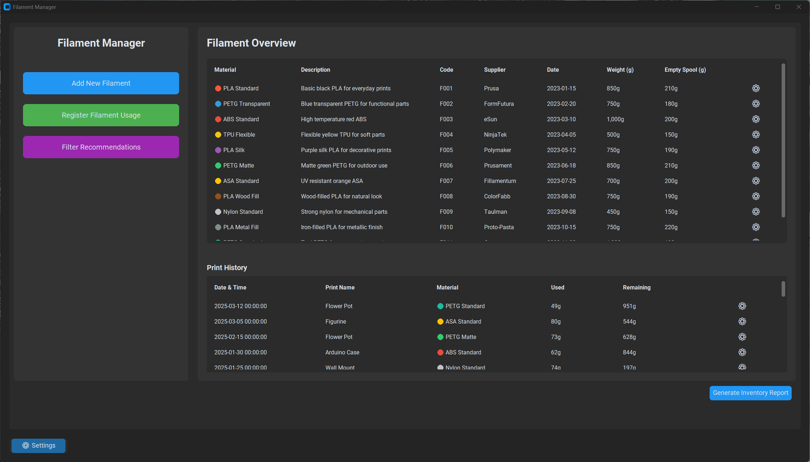
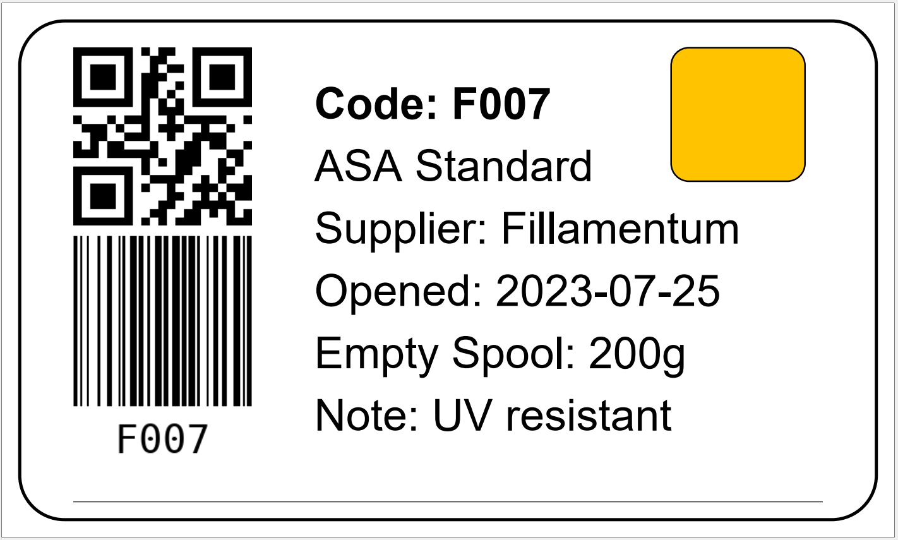
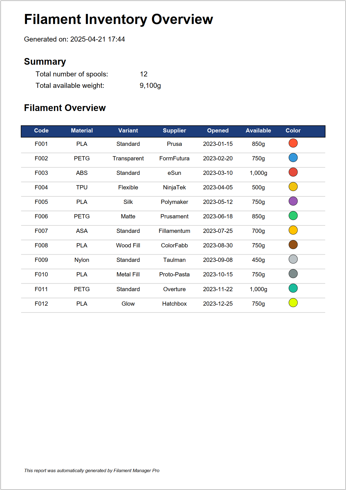

# Filament Manager

A comprehensive application for managing 3D printing filament inventory, designed for hobbyists and small businesses.



## Features

- **Filament Inventory Tracking**: Keep track of your filament spools with detailed information (material, color, weight, supplier)
- **Usage Tracking**: Record the usage of filament for each print
- **Print History**: Maintain a history of all prints with filament usage statistics
- **Label Generation**: Create labels for your filament spools with QR codes
- **Inventory Reports**: Generate PDF reports of your filament inventory
- **Data Backup & Restore**: Backup and restore your filament data

## Screenshots

### Filament Label Generation


### Inventory PDF Report


## Requirements

- Python 3.7 or higher
- Required packages:
  - customtkinter
  - tkinter
  - tkcalendar
  - openpyxl
  - pillow
  - reportlab
  - qrcode
  - python-barcode

## Installation

1. Clone the repository or download the source code:
```
git clone https://github.com/laurensguijt/Filament-Manager.git
```

2. Install the required packages:
```
pip install customtkinter tkcalendar openpyxl pillow reportlab qrcode python-barcode
```

## Usage

Run the application:

```
python main.py
```

## Building an Executable

To create a standalone Windows executable (.exe) file that you can share with others:

### Manual Building

1. Install PyInstaller:
   ```
   pip install pyinstaller
   ```

2. Build the executable using the provided spec file:
   ```
   pyinstaller --clean filament_manager.spec
   ```

3. Find the executable in the `dist\Filament Manager` folder.

## Project Structure

The application is organized in a modular structure:

- `main.py`: Entry point of the application
- `/py`: Python modules
  - `models.py`: Data classes for filament and print logs
  - `data_operations.py`: Excel data operations
  - `ui_components.py`: UI widgets and components
  - `report_generator.py`: PDF report generation
  - `app.py`: Main application class
  - `/dialogs`: Dialog windows
    - `filament_edit_dialog.py`: Dialog for editing filaments
    - `add_filament_dialog.py`: Dialog for adding new filaments
    - `usage_dialog.py`: Dialog for registering filament usage
    - `settings_dialog.py`: Settings and configuration
    - `filter_dialog.py`: Filter recommendations

## Data Storage

The application uses an Excel file (`filament_data.xlsx`) to store all data with the following sheets:
- `Filament_Data`: Stores information about all filament spools
- `Print_Log`: Maintains the history of prints and filament usage

## Support the Project

If you find this application useful, consider supporting its development:

[](https://www.paypal.com/donate/?hosted_button_id=WL2FS9CY2E3NA)

## Contributing

Contributions are welcome! If you'd like to contribute to this project:

1. Fork the repository
2. Create a new branch for your feature
3. Commit your changes
4. Push to the branch
5. Create a new Pull Request

## License

This project is open-source and available under the MIT License.

## Repository

https://github.com/laurensguijt/Filament-Manager 
